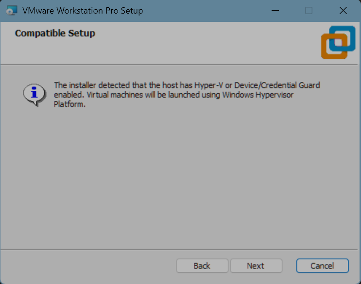

# Installation Guide

## VMware Workstation Pro

Anyone can download VMware Workstation **Pro** for free thanks to Broadcom.

> 25H2 version does not support Chinese. v17 version is also OK.

While installing, you may encounter some problems:



If you see this, it means that Hyper-V is enabled on your system. Although VMware Workstation Pro can run with Hyper-V enabled, it may cause performance issues. To disable Hyper-V, you can follow these steps:

Check if Hyper-V is enabled by running the following command in Command Prompt as Administrator:

```cmd
systeminfo
```

If you see "Hyper-V Requirements: A hypervisor has been detected. Features required for Hyper-V will not be displayed."(Hyper-V 要求: 已检测到虚拟机监控程序。将不显示 Hyper-V 所需的功能。) in the output, it means Hyper-V is enabled.

> *Note: Windows 10/11 can NOT disable Hyper-V feature completely (for Home/Professtional/etc. version), but Windows Server can.*

**Any step affects after the next reboot.**

First, check Program and Features and disable them if exists:

- Windows Sandbox
- Virtual Machine Platform
- Windows Hypervisor Platform
- Hyper-V

Then, open CMD as Administrator.

```cmd
bcdedit /set hypervisorlaunchtype off
bcdedit /set vsmlaunchtype off
```

```cmd
dism /online /disable-feature /featurename:Microsoft-Hyper-V-All /norestart
dism /online /disable-feature /featurename:VirtualMachinePlatform /norestart
dism /online /disable-feature /featurename:HypervisorPlatform /norestart
dism /online /disable-feature /featurename:Containers-DisposableClientVM /norestart
```

And regedit:

```reg
HKEY_LOCAL_MACHINE\SYSTEM\CurrentControlSet\Control\Lsa
  - RunAsPPL = 0
  - RunAsPPLBoot = 0

HKEY_LOCAL_MACHINE\SYSTEM\CurrentControlSet\Control\DeviceGuard
  - EnableVirtualizationBasedSecurity = 0
```

Don't forget to shut down the Memory Integrity in Windows Security Center.

Back to installation, it may ask you to install the enhanced keyboard driver, just click "Install" and it will work fine.

Other problems, please bing. `:D`

## Import Virtual Machine

Download the VM image from [Onedrive](https://1drv.ms/f/c/e8642dbeac76c2db/IgBq3qhhLVwlRbLMXi1qdx8LATEnlu_rQtwk3hKYZL3XUZ8?e=PdE7xc).

You should download these all:

- Windows0.mf
- Windows0.ovf
- Windows0-disk1.vmdk
- Windows0-file1.nvram

Then, open VMware Workstation Pro, click "File" > "Open", and select the `Windows0.ovf` file. Follow the steps to import the virtual machine. Don't forget to rename.

> `init_state` snapshot is stored defaultly.
>
> If you don't see it, start the virtual machine and wait until the desktop appears, then capture a snapshot and name it `init_state`.
>
> This snapshot will be used for resetting the virtual machine to its initial state after each task.
