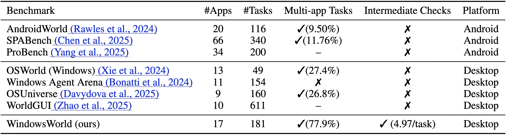
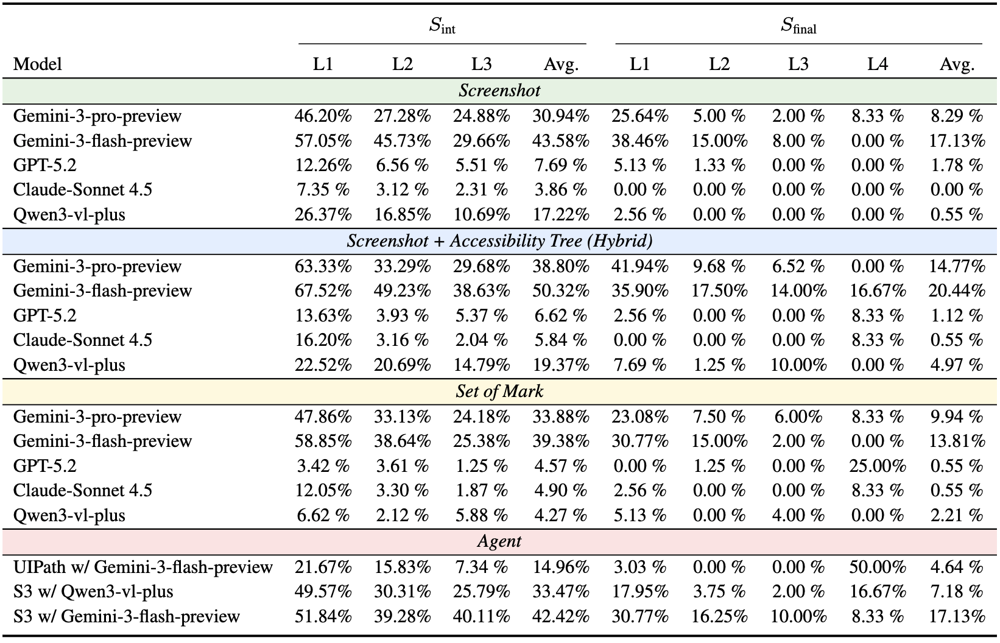
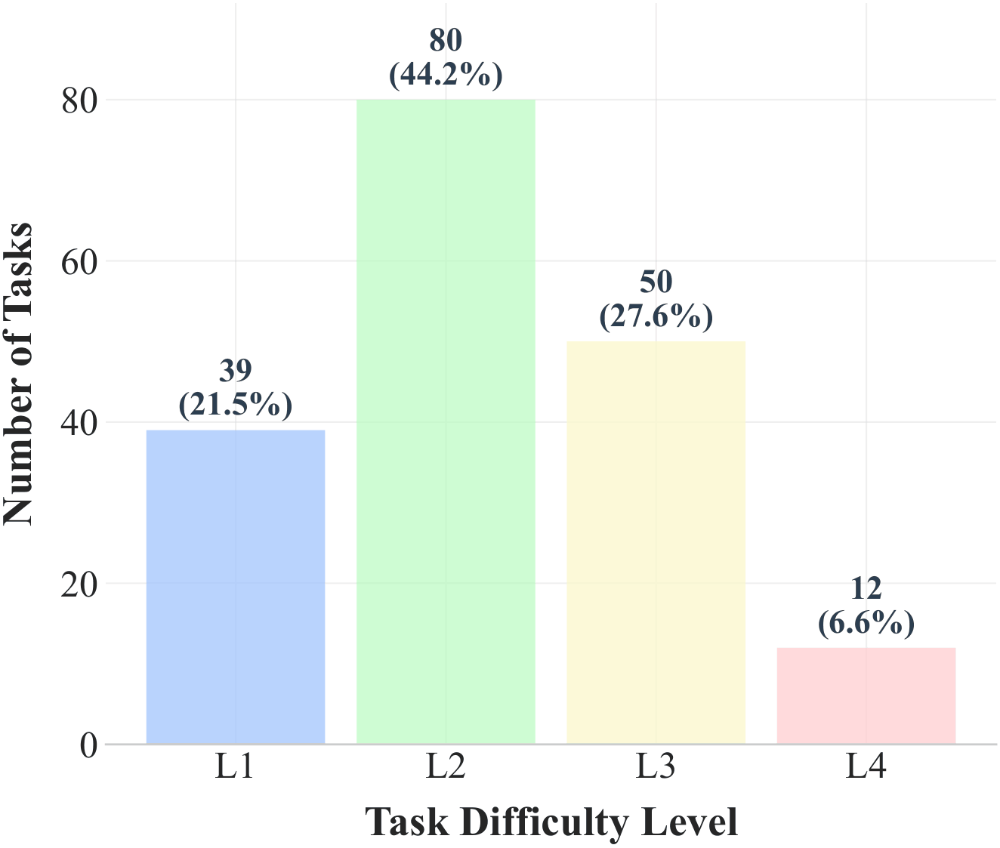
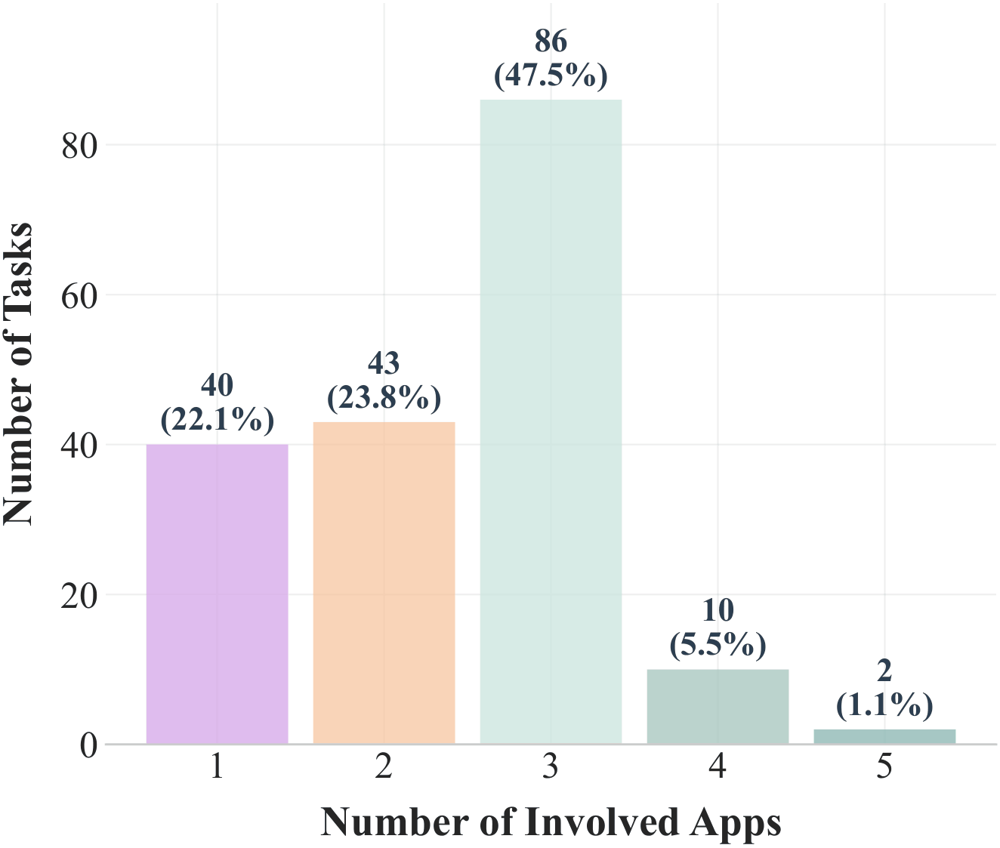
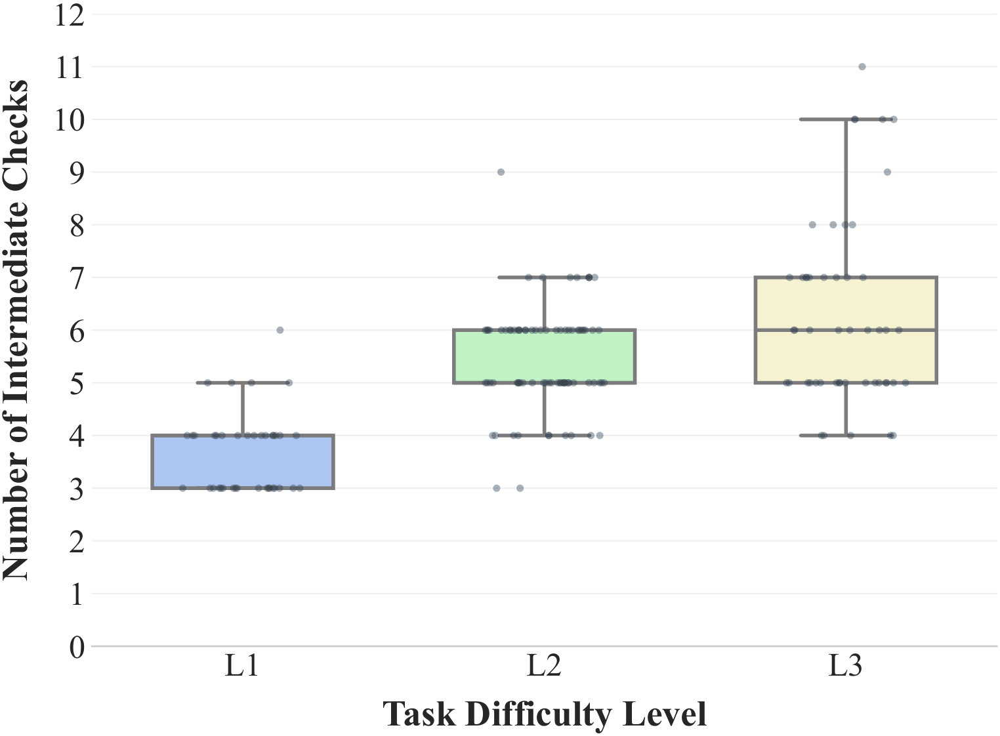

# WindowsWorld: A Process-Centric Benchmark of Autonomous GUI Agents in Professional Cross-Application Environments


WindowsWorld is a computer-use benchmark in cross-application workflows designed to systematically assess GUI Agents on complex multistep tasks that mirror real-world professional activities.


**Fig. 1 Comparison of execution-based benchmarks.** “Multi-app” indicates tasks with two or more applications; “Intermediate Checks” indicates tasks with intermediate-state checkpoints rather than result-only end-state
evaluation. WindowsWorld contains the most apps and focuses on multi-app tasks across desktop benchmarks.

- **181 tasks** across **17 desktop applications**
- **4 difficulty levels (L1–L4)**: 21.5% / 44.2% / 27.6% / 6.6%
- **77.9% multi-app tasks**, reflecting realistic cross-application workflows
- App-count distribution: **22.1% / 23.8% / 47.5% / 5.5% / 1.1%** for tasks involving **1 / 2 / 3 / 4 / 5 apps**
- **4.97 intermediate checkpoints per task on average** for process-aware evaluation
- Grounded in **16 professional personas** and diverse real-world office scenarios

## 📊 Experimental Results



**Fig. 2 Model and Agents Performance on our WindowsWorld.** All large models use a unified PyAutoGUI action space, while UiPath employs the Computer_13 action space from OSWorld. Pure models are evaluated under Screenshot, Screenshot + Accessibility Tree, and Set-of-Mark inputs; Agent-based systems (S3 and UiPath) use Screenshot input. Moreover, S3 and UiPath are integrated UI-TARS-1.5-7B as a grounding model. Each task is executed under a fixed maximum step budget that depends on task level: 15 (L1), 25 (L2), 40 (L3), and 20 (L4). $S_{\mathrm{int}}$ averages L1–L3 intermediate checkpoints and $S_{\mathrm{final}}$ averages L1–L4 final task completion.

## 💾 Installation

Support: Windows 10/11, Windows Server 2022/2025

### 1. Set up VMWare Workstation Pro

[Official Website](https://www.vmware.com/products/desktop-hypervisor/workstation-and-fusion)

[Onedrive: ver. 25H2](https://1drv.ms/u/c/e8642dbeac76c2db/IQCdgyZYiEbEQJXobPBkeVxEAVDPP8v1urchER7YzbMiEKI?e=p9ladN)

> You may need to sign up a Broadcom account to download the software (free). Any version is OK.
>
> *Notice: newer versions do not support Chinese.*

Require `vmrun` in PATH.

Default installation path is `C:\Program Files (x86)\VMware\VMware Workstation\vmrun.exe`, check it by:

```bash
vmrun
```

It should print the usage of `vmrun` if it's correctly installed and added to PATH.

### 2. Set up environment  

Requires (and validated on) `Python 3.11+`.

First, clone this repository:

```bash
git clone https://github.com/HITsz-TMG/WindowsWorld.git
cd WindowsWorld
```

Then, install dependencies:

```bash
# Create and activate a new conda environment
conda create -n windowsworld python=3.11 -y
conda activate windowsworld
# Install dependencies
pip install -r requirements.txt
```

### 3. API Key Configure

Set the environment variables for keys:

| Model Type |         KEY         |         URL          |
|:----------:|:-------------------:|:--------------------:|
|    GPT     |  `OPENAI_API_KEY`   |  `OPENAI_API_BASE`   |
|   Gemini   |  `GEMINI_API_KEY`   |  `GEMINI_API_BASE`   |
|   Claude   | `ANTHROPIC_API_KEY` | `ANTHROPIC_API_BASE` |
|    Qwen    |   `QWEN_API_KEY`    |   `QWEN_API_BASE`    |

### 4. VM Image

Import the virtual machine by following this guide: [`./Installation Guide.md`](./Installation%20Guide.md).

The virtual machine's folder structure should be like this:

```plaintext
D:\Virtual Machines
├── Windows0
│   ├── Windows0-disk1.vmx
│   ├── Windows0.vmdk
│   └── ...
├── Windows1
│   ├── Windows1-disk1.vmx
│   ├── ...
```

## 🚀 Getting Started

### Run the Benchmark:

```bash
python hf_run.py
    -b benchmark.json \
    -v path_to_vm_image_folder \
    -m model_name \
    -a pyautogui/computer_13 \
    -o screenshot/som/a11y/screenshot_a11y \
    -c parallel_count
```

- `path_to_vm_image_folder` is the folder that contains the VM image you downloaded, such as: `D:\Virtual Machines\WindowsWorld`.
- `model_name` literally decides which model api to use (in code).
- `-a` is action space:
  - `pyautogui` is to directly use `PyAutoGUI`;
  - `computer_13` accords to this file: `./mm_agents/prompts.py (line 44)`.
- `-o` is observation type:
  - `screenshot` is to only use screenshot as observation;
  - `a11y` is to only use accessibility information as observation;
  - `screenshot_a11y` is to use both screenshot and accessibility information as observation;
  - `som` is Set-of-Mark.

Example:

```bash
python hf_run.py \
  -b benchmark.json \
  -v "D:\Virtual Machines" \
  -m gemini-3-flash-preview \
  -a computer_13 \
  -o screenshot \
  -c 1
```

### Show Results

You can use the following commands to summarize results after running the benchmark:

```bash
# Default: read results from ./hf_result
python show_result.py
```

## 🎯 Benchmark Statistics
<p align="center">
    
  </a>
    
  </a>
    
  </a>
</p>

<p align="center">
  <em><strong>Figure 3:</strong> Benchmark analysis of WindowsWorld.
  <strong>(a)</strong> Distribution of tasks across difficulty levels (L1-L4), highlighting the prevalence of non-trivial multi-step workflows.
  <strong>(b)</strong> Distribution of the number of applications per task, highlighting the prevalence of multi-app workflows.
  <strong>(c)</strong> Distribution of task checkpoints by difficulty (L1-L3), showing increased checkpoint density for complex tasks.</em>
</p>

## Acknowledgement

This project builds upon [OSWorld](https://github.com/xlang-ai/OSWorld).
A substantial portion of the evaluation framework is derived from or adapted from OSWorld.
We thank the OSWorld authors for open-sourcing their benchmark and infrastructure.

The OSWorld-derived portions of this repository remain subject to the Apache License 2.0.

## Citation

Please cite our paper if you find this benchmark useful for your research:

```bibtex
@inproceedings{li2026windowsworld,
  title={WindowsWorld: A Process-Centric Benchmark of Autonomous GUI Agents in Professional Cross-Application Environments},
  author={Jinchao Li and Yunxin Li and Chenrui Zhao and Zhenran Xu and Baotian Hu and Min Zhang},
  booktitle={Findings of the Association for Computational Linguistics: ACL 2026},
  year={2026},
  url={https://openreview.net/forum?id=qDZP06FdPl}
}
```